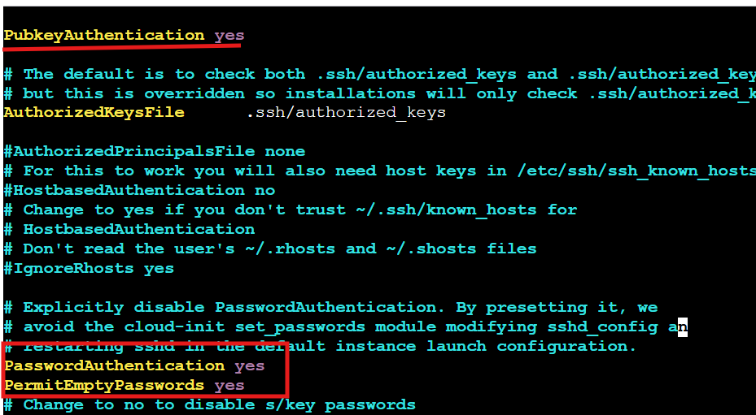

# Connecting to a Remote Server in a Private Subnet

A remote server in a private subnet does not have direct internet access or external SSH access from the public internet. To connect, you typically use a jump server (bastion host) in the public subnet. The process involves generating SSH keys, copying the public key to the remote server, and ensuring SSH configurations are correct.

---

## Steps to Connect

### 1. Generate SSH Key on Jump Server

Generate an SSH key on the jump server:

```bash
ssh-keygen -t rsa -b 4096
```

- `-t rsa`: Use RSA algorithm.
- `-b 4096`: 4096-bit key for security.

This creates:
- **Private Key** (`id_rsa`): Keep on jump server.
- **Public Key** (`id_rsa.pub`): Copy to target server.

---

### 2. Copy Public Key to Target Server

Try to copy the public key:

```bash
ssh-copy-id username@remote_server_ip
```
 

If you get a "permission denied" error, direct SSH access may be blocked. Use a jump server or VPN, or manually copy the key.

---

### 3. Avoid Editing `sshd_config` for Public Key Authentication

By default, public key authentication should be enabled. On the target server, check `/etc/ssh/sshd_config`:

```text
PubkeyAuthentication yes
PasswordAuthentication yes    # Optional
PermitEmptypPasswords yes           # Disable unless needed
```

If you don't want to edit these, ensure your public key is in `~/.ssh/authorized_keys`.
After updating the SSH configuration, apply the changes by restarting the SSH service:

```bash
sudo systemctl restart sshd
```

This ensures your new authentication settings take effect.
---

### 4. Manually Copy the Public Key

If `ssh-copy-id` fails, manually copy the public key:

1. On the jump server:
    ```bash
    cat ~/.ssh/id_rsa.pub
    ```
    Copy the output.

2. Log in to the target server:
    ```bash
    ssh username@remote_server_ip
    ```

3. On the target server:
    ```bash
    mkdir -p ~/.ssh
    echo "your-copied-public-key" >> ~/.ssh/authorized_keys
    chmod 700 ~/.ssh
    chmod 600 ~/.ssh/authorized_keys
    ```

---

### 5. Restart SSH Service

If you made changes, restart SSH:

```bash
sudo systemctl restart sshd
```

---
## 6. Test SSH Connection from Jump Host to Remote Server

After setting up keys and configurations, verify the connection:

```bash
ssh username@remoteServer_ip
```


If successful, you should be logged into the remote server via the jump host. If you encounter issues, check SSH key permissions and firewall rules.
## Script: Update `sshd_config` Settings

Use this script to update SSH authentication settings:

```bash
#!/bin/bash

# Usage: ./update_sshd_config.sh <PubkeyAuthentication> <PasswordAuthentication>
# Example: ./update_sshd_config.sh yes yes

PUBKEY_AUTH=$1
PASSWORD_AUTH=$2
SSHD_CONFIG="/etc/ssh/sshd_config"

if [ "$EUID" -ne 0 ]; then
  echo "Please run as root"
  exit 1
fi

cp $SSHD_CONFIG "${SSHD_CONFIG}.bak"

if grep -q "^PubkeyAuthentication" $SSHD_CONFIG; then
    sed -i "s/^PubkeyAuthentication.*/PubkeyAuthentication $PUBKEY_AUTH/" $SSHD_CONFIG
else
    echo "PubkeyAuthentication $PUBKEY_AUTH" >> $SSHD_CONFIG
fi

if grep -q "^PasswordAuthentication" $SSHD_CONFIG; then
    sed -i "s/^PasswordAuthentication.*/PasswordAuthentication $PASSWORD_AUTH/" $SSHD_CONFIG
else
    echo "PasswordAuthentication $PASSWORD_AUTH" >> $SSHD_CONFIG
fi

systemctl restart sshd

echo "Updated sshd_config with PubkeyAuthentication=$PUBKEY_AUTH and PasswordAuthentication=$PASSWORD_AUTH"
```

---

**Note:** Always backup configuration files before making changes.