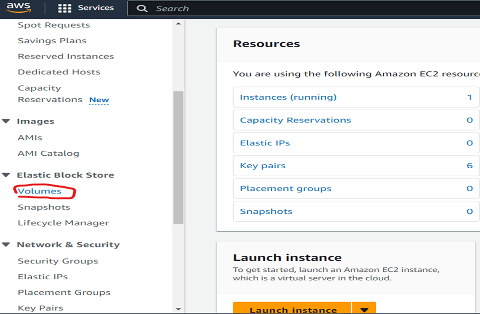
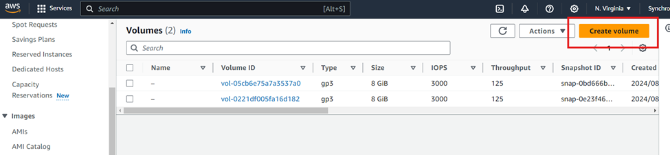

# Amazon Elastic Block Store (EBS) Overview


Amazon Elastic Block Store (EBS) is a scalable block storage service designed for use with Amazon EC2 instances.

## Key Features

### 1. Persistence
- Data persists independently of EC2 instance lifecycle
- Data remains intact if instance is stopped/terminated

### 2. Elasticity
- Volumes can be resized and type changed dynamically

### 3. Durability
- 99.999% availability
- Data replicated within Availability Zone

### 4. Snapshot
- Incremental backups stored in S3
- Can create new volumes, restore, or transfer across regions

### 5. Encryption
- Encryption at rest using AWS KMS
- Automatic encryption during data transfer

### 6. Multi-Attach (io1/io2)
- Multiple EC2 instances can attach to single volume
- Useful for high availability applications

## Volume Types

| Type               | Description                                                                 | Use Cases                      |
|--------------------|-----------------------------------------------------------------------------|--------------------------------|
| General Purpose SSD (gp2/gp3) | Balanced price/performance (gp3: 3,000 IOPS baseline) | Wide range of workloads        |
| Provisioned IOPS SSD (io1/io2) | High performance (up to 64,000 IOPS) | Latency-sensitive applications |
| Throughput HDD (st1) | Low-cost HDD for throughput-intensive workloads | Big data, data warehouses      |
| Cold HDD (sc1)     | Lowest cost for infrequently accessed data                                  | Cold data storage              |

## Creating and Managing EBS Volumes

### 1. Creating a Volume
1. Navigate to EC2 Dashboard → EBS → Volumes
2. Click "Create Volume"
3. Configure settings:
   - Type (gp3, io2, etc.)
   - Size (GiB)
   - Availability Zone
   - Encryption




### 2. Attaching a Volume
1. Select volume → Actions → "Attach Volume"
2. Choose instance and device name
3. Click "Attach"


### 3. Mounting in Linux
```bash
# Check detected volumes
lsblk

# Format new volume (if needed)
sudo mkfs -t ext4 /dev/xvdf

# Create mount point
sudo mkdir /mnt/data

# Mount volume
sudo mount /dev/xvdf /mnt/data

# Verify
df -h